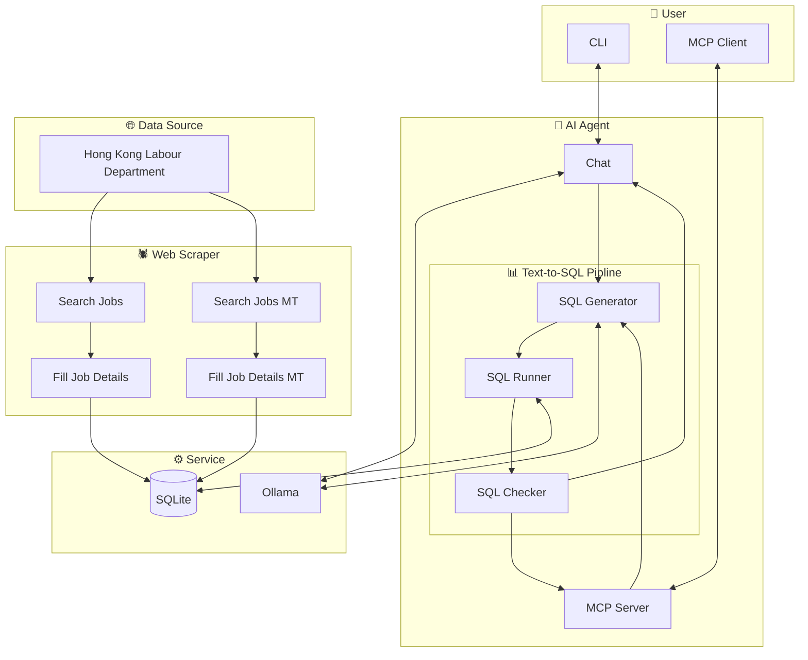

# Hong Kong Labour Department Job Listing Scraper & AI Agent

**Languages:** [简中](README_zh_cn.md) | [繁中](README_zh_hk.md)

## 📋 Description
The Hong Kong Labour Department publishes a large number of job listings publicly, but manually collecting them one by one is highly inefficient. This project aims to automatically aggregate this data in one place, making it easier to analyse and apply for jobs.

The scraper fetches job listing pages via Python's `requests` library, parses HTML elements with `BeautifulSoup`, and cleans and organises the extracted information using regular expressions. The structured data is then stored in a `SQLite` database.

> **Disclaimer:**
> 1. This project strictly complies with the `robots.txt` specifications and is licensed under the MIT License.
> 2. Any third-party forks or derivative works based on this project represent the independent actions of their respective developers and have no association with this project or the original author.
> 3. Developers shall be solely responsible for any legal liability arising from the use or modification of this source code.

## 🏗️ Structure


## 🚀 Usage
### 🛠️ Environment
Activate Environment
```sh
uv sync
source .venv/bin/activate
```
### 🕷️ Web Scraper
#### Common
Common web scrapering don't need to configure proxy.
* Search Job Listings
    ```sh
    run-search-job
    ```
    ```log
    2026-04-12 20:25:02 - INFO - Processing page: 1
    2026-04-12 20:25:13 - INFO - Processing page: 2
    2026-04-12 20:25:21 - INFO - Processing page: 3
    ```
* Fill Job Details
    ```sh
    run-fill-job
    ```
    ```log
    2026-04-12 20:37:07 - INFO - Processing job: 機械技術員
    2026-04-12 20:37:18 - INFO - Processing job: 電氣技術員
    2026-04-12 20:37:25 - INFO - Processing job: 西醫診所助理
    ```
#### Concurrent
Concurrent web scrapering need to configure proxy.

Configuration file `config.toml`
```toml
[proxy]
host = "127.0.0.1"
port_start = 10801  # Start port of the proxy servers
offset = 5          # The offset of the proxy ports
rate = 0.75         # The percentage of threads actually created out of the total number of proxy ports
```
* Search Job Listings
    ```sh
    run-search-job-MT
    ```
    ```log
    2026-07-25 15:38:42 - [Worker-1] - INFO - Processing page: 1
    2026-07-25 15:38:45 - [Worker-2] - INFO - Processing page: 2
    2026-07-25 15:38:48 - [Worker-3] - INFO - Processing page: 3
    2026-07-25 15:38:51 - [Worker-4] - INFO - Processing page: 4
    2026-07-25 15:39:01 - [Worker-2] - INFO - Processing page: 5
    2026-07-25 15:39:02 - [Worker-1] - INFO - Processing page: 6
    ```
* Fill Job Details
    ```sh
    run-fill-job-MT
    ```
    ```log
    2026-07-25 15:41:32 - [Worker-1] - INFO - Processing job: 助理大廈主管 (日更, 柴灣)
    2026-07-25 15:41:35 - [Worker-2] - INFO - Processing job: 福音幹事III兼行政助理(港島東隊教會)
    2026-07-25 15:41:38 - [Worker-3] - INFO - Processing job: 電氣技術員
    2026-07-25 15:41:41 - [Worker-4] - INFO - Processing job: 冷氣技術員
    2026-07-25 15:41:45 - [Worker-1] - INFO - Processing job: 機械技術員
    2026-07-25 15:41:53 - [Worker-3] - INFO - Processing job: 合約工程助理
    ```
### 🤖 AI Agent
Configuration file `config.toml`
```toml
[ollama]
host = "192.168.6.101"
chat_model = "llama3.2:3b"
code_model = "qwen2.5-coder:7b"
```
#### Chat
```sh
run-ask
```
> **Note:** There are too long output result. Using `...` instead most of content.
* Basic query ask
    ```txt
    >>> I want to know the basic infomation about the scrapered jobs
    ```
    ```md
    Here is a sample of recently scraped jobs from the project database:

    | Job Position | Salary Type | Monthly Range (HKD) | Location |
    | :--- | :--- | :--- | :--- |
    | 助理大廈主管 (日更, 柴灣) | 月薪 | HK$22,000 - 22,500 | 柴灣 |

    ...

    | 公司司機(東涌) | 月薪 | HK$18,000 - 18,500 | 東涌 |

    Would you like to see more details about specific roles or filter the results further?
    ```
* Enhanced query ask(SQL statement stream)
    ```txt
    >>> Find all jobs with salary type as monthly salary and min salary above 30000.
    ```
    ```md
    Here are the jobs matching your criteria (Monthly Salary with minimum of HK$30,001 or above):

    | Job Name | Min Monthly Salary | Max Monthly Salary | Location |
    | :--- | :---: | :---: | :--- |
    | **中港跨境貨車司機** (Cross-border truck driver) | $38,000 | $38,000 | 葵涌，內地 |

    ...
    
    | **註冊安全主任** (Registered Safety Officer) - repeat entry | $35,000 | $45,000 | 元朗 |

    Would you like me to filter results further by a specific job title or company?
    ```
#### MCP
```json
"Jobs HongKong": {
    "type": "stdio",
    "command": "uv",
    "args": [
        "run",
        "-m",
        "jobs_hk.server"
    ]
}
```
