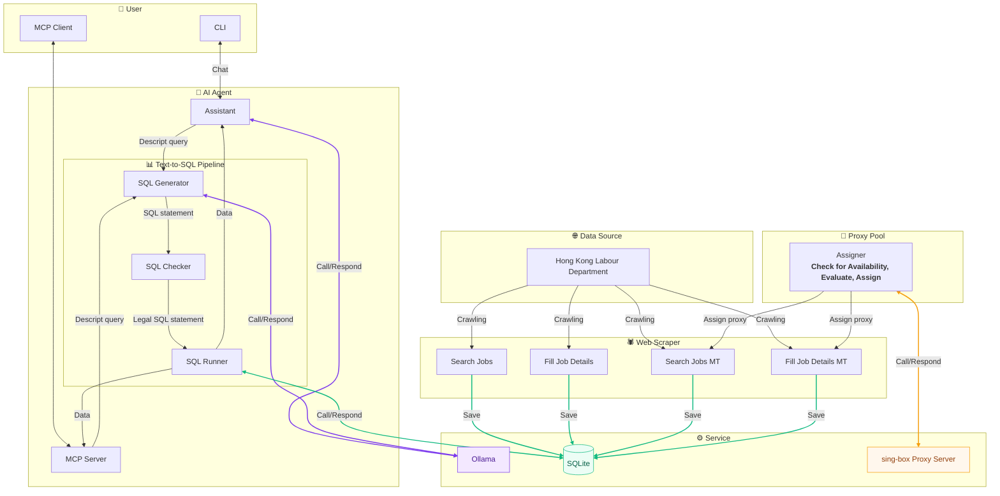

# Hong Kong Labour Department Job Listing Scraper & AI Agent

**Languages:** [简体中文](README_zh_cn.md) | [繁體中文](README_zh_hk.md)

## 📋 Description
The Hong Kong Labour Department publishes a large number of public job vacancies, but collecting them manually one by one is inefficient, and manual analysis is both costly and time-consuming.
This project aims to automatically collect these data centrally and make them available through a built-in AI Agent or via `MCP` for market research and unified analysis.

> **Disclaimer:**
> 1. This project strictly complies with the `robots.txt` specifications and is licensed under the MIT License.
> 2. Any third-party forks or derivative works based on this project represent the independent actions of their respective developers and have no association with this project or the original author.
> 3. Developers shall be solely responsible for any legal liability arising from the use or modification of this source code.

## 💡 Key Highlights
### 🕷️ High-Concurrency & Resilient Data Collection:
* **Multi-mode Parallel Crawling**: Supports both conventional `single-threaded` crawling and proxy-based `multi-threaded concurrent` crawling, significantly improving data collection efficiency.
* **Dynamic Proxy Pool Management**:
    Built-in `proxy pool` allocator designed for `sing-box`,
    supporting proxy availability checks, dynamic scoring, and intelligent allocation,
    effectively overcoming per-IP request rate limits and automatically switching away from unavailable proxy nodes.
### 📊 Structured Data Processing & Persistence
* **High-Precision Data Extraction**:
    Combines `BeautifulSoup` and `Regular Expressions` for deep HTML extraction.
    Accurately cleans and standardizes key fields such as job titles, salary ranges, work locations, and job requirements.
* **Lightweight Database Storage**:
    Automatically archives structured data into a `SQLite` database.
    Builds indexes to provide low-latency local querying and persistent storage.
### 🤖 AI Agent & Text-to-SQL:
* **Text-to-SQL Pipeline**:
    Combines local `Ollama` LLMs to convert natural language into SQL,
    adopting an automatic correction workflow of `SQL Generator ➔ Runner ➔ Checker`,
    enabling accurate multidimensional statistical analysis of the collected data.
* **MCP Integration**:
    Exposes interfaces supporting VSCode Github Copilot, Claude Desktop, and more,
    allowing direct access from fully featured AI clients with powerful models.
* **Context Engineering**:
    Combines database table `DDL`, prompt engineering `prompts`, and `Few-Shot` examples,
    to guide the model with structured reasoning paths and comprehensive data context.
    Finally, `Schemas` are used to constrain the output format, together with `pydantic` validation and automatic retry mechanisms,
    ensuring the generated JSON output is always valid and compliant.
* **SQL Security Auditing & Self-Correction**:
    After the model generates SQL, the system performs security validation immediately.
    Destructive write operations such as INSERT/UPDATE/DELETE/DROP are strictly blocked, allowing only SELECT queries.
    If security violations or SQL syntax errors are detected, the error context is fed back to the model for retry and compliant regeneration,
    ensuring complete database safety and reliable model outputs.
* **Database Security**:
    During initialization, the system strictly separates `read-write` and `read-only` database connection instances.
    Writable connections are used exclusively by the crawler, while the AI Agent accesses the database only through explicitly created read-only connections.

## 🏗️ Structure


## 🚀 Usage
### 🛠️ Environment
Activate Environment
```sh
uv sync
source .venv/bin/activate
```
### 🕷️ Web Scraper
#### Common
Common web scrapering don't need to configure proxy.
* Search Job Listings
    ```sh
    run-search-job
    ```
    ```log
    2026-04-12 20:25:02 - INFO - Processing page: 1
    2026-04-12 20:25:13 - INFO - Processing page: 2
    2026-04-12 20:25:21 - INFO - Processing page: 3
    ```
* Fill Job Details
    ```sh
    run-fill-job
    ```
    ```log
    2026-04-12 20:37:07 - INFO - Processing job: 機械技術員
    2026-04-12 20:37:18 - INFO - Processing job: 電氣技術員
    2026-04-12 20:37:25 - INFO - Processing job: 西醫診所助理
    ```
#### Concurrent
Concurrent web scrapering need to configure proxy.

Configuration file `config.toml`
```toml
[proxy]
host = "127.0.0.1"
port_start = 10801  # Start port of the proxy servers
offset = 5          # The offset of the proxy ports
rate = 0.75         # The percentage of threads actually created out of the total number of proxy ports
```
* Search Job Listings
    ```sh
    run-search-job-MT
    ```
    ```log
    2026-07-25 15:38:42 - [Worker-1] - INFO - Processing page: 1
    2026-07-25 15:38:45 - [Worker-2] - INFO - Processing page: 2
    2026-07-25 15:38:48 - [Worker-3] - INFO - Processing page: 3
    2026-07-25 15:38:51 - [Worker-4] - INFO - Processing page: 4
    2026-07-25 15:39:01 - [Worker-2] - INFO - Processing page: 5
    2026-07-25 15:39:02 - [Worker-1] - INFO - Processing page: 6
    ```
* Fill Job Details
    ```sh
    run-fill-job-MT
    ```
    ```log
    2026-07-25 15:41:32 - [Worker-1] - INFO - Processing job: 助理大廈主管 (日更, 柴灣)
    2026-07-25 15:41:35 - [Worker-2] - INFO - Processing job: 福音幹事III兼行政助理(港島東隊教會)
    2026-07-25 15:41:38 - [Worker-3] - INFO - Processing job: 電氣技術員
    2026-07-25 15:41:41 - [Worker-4] - INFO - Processing job: 冷氣技術員
    2026-07-25 15:41:45 - [Worker-1] - INFO - Processing job: 機械技術員
    2026-07-25 15:41:53 - [Worker-3] - INFO - Processing job: 合約工程助理
    ```
### 🤖 AI Agent
Configuration file `config.toml`
```toml
[ollama]
host = "192.168.6.101"
chat_model = "llama3.2:3b"
code_model = "qwen2.5-coder:7b"
```
#### Chat
```sh
run-ask
```
> **Note:** There are too long output result. Using `...` instead most of content.
* Basic query ask
    ```txt
    >>> I want to know the basic infomation about the scrapered jobs
    ```
    ```md
    Here is a sample of recently scraped jobs from the project database:

    | Job Position | Salary Type | Monthly Range (HKD) | Location |
    | :--- | :--- | :--- | :--- |
    | 助理大廈主管 (日更, 柴灣) | 月薪 | HK$22,000 - 22,500 | 柴灣 |

    ...

    | 公司司機(東涌) | 月薪 | HK$18,000 - 18,500 | 東涌 |

    Would you like to see more details about specific roles or filter the results further?
    ```
* Enhanced query ask(SQL statement stream)
    ```txt
    >>> Find all jobs with salary type as monthly salary and min salary above 30000.
    ```
    ```md
    Here are the jobs matching your criteria (Monthly Salary with minimum of HK$30,001 or above):

    | Job Name | Min Monthly Salary | Max Monthly Salary | Location |
    | :--- | :---: | :---: | :--- |
    | **中港跨境貨車司機** (Cross-border truck driver) | $38,000 | $38,000 | 葵涌，內地 |

    ...
    
    | **註冊安全主任** (Registered Safety Officer) - repeat entry | $35,000 | $45,000 | 元朗 |

    Would you like me to filter results further by a specific job title or company?
    ```
#### MCP
```json
"Jobs HongKong": {
    "type": "stdio",
    "command": "uv",
    "args": [
        "run",
        "-m",
        "jobs_hk.server"
    ]
}
```

## 📝 TODO
⬜ OpenAI SDK instead of Ollama.
⬜ Tool calling path.
⬜ Conversation persistence.
⬜ Codes divided into 3 layers (Infrastructure, Business Logic, Presentation).
