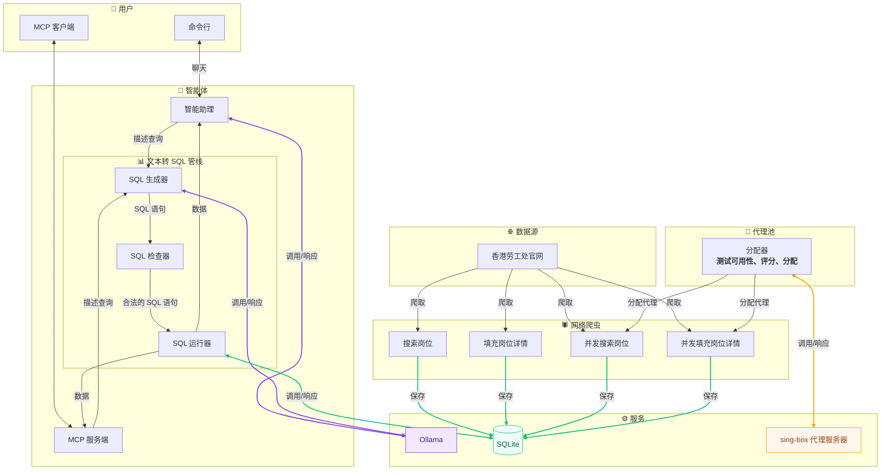

# 香港劳工处招聘信息爬虫与智能体

**Languages:** [English](README.md) | [繁體中文](README_zh_hk.md)

## 📋 描述
香港劳工处公开了大量招聘信息，但人工逐一收集效率低下，人工分析成本高耗时长。
本项目旨在自动化地集中抓取这些数据，并用于内置智能体或提供 `MCP`，便于市场调研与统一分析。

> **免责声明：**
> 1. 本项目严格遵守 `robots.txt` 规范及 MIT 开源协议。
> 2. 任何第三方 Fork 或基于本项目二次开发的衍生项目，其行为均属开发者个人行为，与本项目及原作者无关。
> 3. 开发者须自行承担因使用或修改本代码而产生的法律责任。

## 💡 核心亮点
### 🕷️ 高并发弹性数据采集：
* **多模式并行抓取**：支持常规`单线程`采集及基于代理的`多线程并发`采集，大幅提升数据抓取效率。
* **动态代理池管理**：
    内置针对 `sing-box` 的`代理池`分配器，
    支持代理可用性检测、动态评分与智能分配，
    有效解决针对单 IP 的请求频率限制及代理节点掉线无法有效切换的问题。
### 📊 结构化清洗与持久化
* **高精度数据解析**：
    结合 `BeautifulSoup` 与`正则表达式`对 HTML 进行深度提取。
    精准清洗并标准化岗位名称、薪资范围、工作地点及任职要求等关键字段。
* **轻量化数据库存储**：
    将结构化数据自动归档至 `SQLite` 数据库。
    构建索引并提供低延迟的本地数据检索与持久化存储能力。
### 🤖 智能体 与 Text-to-SQL：
* **Text-to-SQL 管线**：
    结合本地 `Ollama` LLM 实现自然语言转 SQL 操作，
    采用 `SQL 生成器 ➔ 运行器 ➔ 检查器` 的自动纠错机制，
    支持对抓取数据进行精确的多维度统计分析。
* **MCP 集成**：
    开放接口，支持 VSCode Github Copilot, Claude Desktop 等，
    有高算力模型、功能完善的客户端直接调用。
* **上下文工程**：
    结合数据表定义 `DDL`、提示词 `prompts` 工程、少样本 `Few-Shot` 示例，
    为模型规范思维路径及提供完善的数据源。
    最后通过 `Schemas` 结构化约束模型的输出格式，及 `pydantic` 的再次校验和重试机制，
    确保最终输出的 JSON 格式合规。
* **SQL 安全审计与自我纠错**：
    模型生成 SQL 后，系统会第一时间进行安全检查。
    严格拦截 INSERT/UPDATE/DELETE/DROP 等破坏性写操作，仅允许 SELECT 查询。
    若触发安全违规或语法错误，系统会将错误上下文反馈给模型进行重试与合规重构，
    确保数据库绝对安全与模型输出可靠。
* **数据库安全**：
    执行初始化时，严格区分`读写`和`只读`两类数据库连接实例。
    用于爬虫存入数据和用于智能体读取数据的分别显式地创建为两种不同类型的数据库连接。

## 🏗️ 架构


## 🚀 使用方法
### 🛠️ 环境
激活环境
```sh
uv sync
source .venv/bin/activate
```
### 🕷️ 爬虫
#### 常规
常规爬虫无需配置代理
* 搜索工作信息
    ```sh
    run-search-job
    ```
    ```log
    2026-04-12 20:25:02 - INFO - Processing page: 1
    2026-04-12 20:25:13 - INFO - Processing page: 2
    2026-04-12 20:25:21 - INFO - Processing page: 3
    ```
* 补全工作信息
    ```sh
    run-fill-job
    ```
    ```log
    2026-04-12 20:37:07 - INFO - Processing job: 機械技術員
    2026-04-12 20:37:18 - INFO - Processing job: 電氣技術員
    2026-04-12 20:37:25 - INFO - Processing job: 西醫診所助理
    ```
#### 并发
并发爬虫需要配置代理

配置文件 `config.toml`
```toml
[proxy]
host = "127.0.0.1"
port_start = 10801  # 代理服务器的起始端口
offset = 5          # 代理端口的偏移量
rate = 0.75         # 实际创建的线程占代理端口总数的比
```
* 搜索工作信息
    ```sh
    run-search-job-MT
    ```
    ```log
    2026-07-25 15:38:42 - [Worker-1] - INFO - Processing page: 1
    2026-07-25 15:38:45 - [Worker-2] - INFO - Processing page: 2
    2026-07-25 15:38:48 - [Worker-3] - INFO - Processing page: 3
    2026-07-25 15:38:51 - [Worker-4] - INFO - Processing page: 4
    2026-07-25 15:39:01 - [Worker-2] - INFO - Processing page: 5
    2026-07-25 15:39:02 - [Worker-1] - INFO - Processing page: 6
    ```
* 补全工作信息
    ```sh
    run-fill-job-MT
    ```
    ```log
    2026-07-25 15:41:32 - [Worker-1] - INFO - Processing job: 助理大廈主管 (日更, 柴灣)
    2026-07-25 15:41:35 - [Worker-2] - INFO - Processing job: 福音幹事III兼行政助理(港島東隊教會)
    2026-07-25 15:41:38 - [Worker-3] - INFO - Processing job: 電氣技術員
    2026-07-25 15:41:41 - [Worker-4] - INFO - Processing job: 冷氣技術員
    2026-07-25 15:41:45 - [Worker-1] - INFO - Processing job: 機械技術員
    2026-07-25 15:41:53 - [Worker-3] - INFO - Processing job: 合約工程助理
    ```
### 🤖 智能体
配置文件 `config.toml`
```toml
[ollama]
host = "192.168.6.101"
chat_model = "llama3.2:3b"      # 聊天模型
code_model = "qwen2.5-coder:7b" # 编程模型
```
#### 询问
```sh
run-ask
```
> **注意：** 输出结果过多，已将大部分内容用 `...` 略过
* 基础查询
    ```txt
    >>> I want to know the basic infomation about the scrapered jobs
    ```
    ```md
    Here is a sample of recently scraped jobs from the project database:

    | Job Position | Salary Type | Monthly Range (HKD) | Location |
    | :--- | :--- | :--- | :--- |
    | 助理大廈主管 (日更, 柴灣) | 月薪 | HK$22,000 - 22,500 | 柴灣 |

    ...

    | 公司司機(東涌) | 月薪 | HK$18,000 - 18,500 | 東涌 |

    Would you like to see more details about specific roles or filter the results further?
    ```
* 增强查询(SQL 语句流)
    ```txt
    >>> Find all jobs with salary type as monthly salary and min salary above 30000.
    ```
    ```md
    Here are the jobs matching your criteria (Monthly Salary with minimum of HK$30,001 or above):

    | Job Name | Min Monthly Salary | Max Monthly Salary | Location |
    | :--- | :---: | :---: | :--- |
    | **中港跨境貨車司機** (Cross-border truck driver) | $38,000 | $38,000 | 葵涌，內地 |

    ...
    
    | **註冊安全主任** (Registered Safety Officer) - repeat entry | $35,000 | $45,000 | 元朗 |

    Would you like me to filter results further by a specific job title or company?
    ```
#### MCP
```json
"Jobs HongKong": {
    "type": "stdio",
    "command": "uv",
    "args": [
        "run",
        "-m",
        "jobs_hk.server"
    ]
}
```
