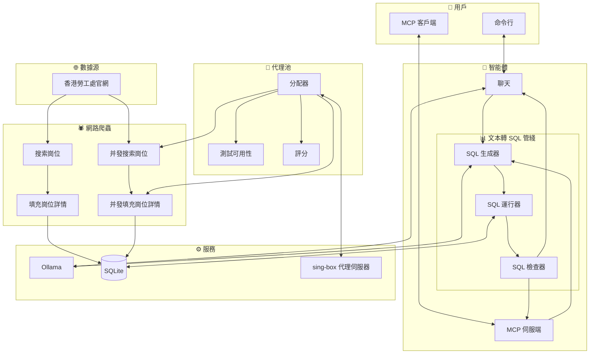

# 香港勞工處招聘資訊爬蟲與智能體

**Languages:** [简体中文](README_zh_cn.md) | [English](README.md)

## 📋 描述
香港勞工處公開了大量招聘資訊，但人工逐一收集效率低下，本專案旨在自動化地集中抓取這些資料，便於統一分析與求職投遞。

程式透過 Python 的 `requests` 庫獲取招聘頁面，使用 `BeautifulSoup` 解析 HTML 元素，並借助正則表達式對資訊進行清洗與整理，最終將結構化資料存入 `SQLite` 資料庫。

> **免責聲明：**
> 1. 本項目嚴格遵守 `robots.txt` 規範及 MIT 開源協議。
> 2. 任何第三方 Fork 或基於本項目二次開發之衍生項目，其行為均屬開發者之個人行為，概與本項目及原作者無關。
> 3. 開發者須自行承擔因使用或修改本代碼而產生之一切法律責任。

## 🏗️ 架構


## 🚀 使用方法
### 🛠️ 環境
啟用環境
```sh
uv sync
source .venv/bin/activate
```
### 🕷️ 爬蟲
#### 常規
常規爬蟲無需配置代理
* 搜尋職缺資訊
    ```sh
    run-search-job
    ```
    ```log
    2026-04-12 20:25:02 - INFO - Processing page: 1
    2026-04-12 20:25:13 - INFO - Processing page: 2
    2026-04-12 20:25:21 - INFO - Processing page: 3
    ```
* 補全職缺資訊
    ```sh
    run-fill-job
    ```
    ```log
    2026-04-12 20:37:07 - INFO - Processing job: 機械技術員
    2026-04-12 20:37:18 - INFO - Processing job: 電氣技術員
    2026-04-12 20:37:25 - INFO - Processing job: 西醫診所助理
    ```
#### 并發
并發爬蟲需要配置代理

配置文件 `config.toml`
```toml
[proxy]
host = "127.0.0.1"
port_start = 10801  # 代理伺服器的起始端口
offset = 5          # 代理端口的偏移量
rate = 0.75         # 實際創建的綫程占代理端口總數的比
```
* 搜尋職缺資訊
    ```sh
    run-search-job-MT
    ```
    ```log
    2026-07-25 15:38:42 - [Worker-1] - INFO - Processing page: 1
    2026-07-25 15:38:45 - [Worker-2] - INFO - Processing page: 2
    2026-07-25 15:38:48 - [Worker-3] - INFO - Processing page: 3
    2026-07-25 15:38:51 - [Worker-4] - INFO - Processing page: 4
    2026-07-25 15:39:01 - [Worker-2] - INFO - Processing page: 5
    2026-07-25 15:39:02 - [Worker-1] - INFO - Processing page: 6
    ```
* 補全職缺資訊
    ```sh
    run-fill-job-MT
    ```
    ```log
    2026-07-25 15:41:32 - [Worker-1] - INFO - Processing job: 助理大廈主管 (日更, 柴灣)
    2026-07-25 15:41:35 - [Worker-2] - INFO - Processing job: 福音幹事III兼行政助理(港島東隊教會)
    2026-07-25 15:41:38 - [Worker-3] - INFO - Processing job: 電氣技術員
    2026-07-25 15:41:41 - [Worker-4] - INFO - Processing job: 冷氣技術員
    2026-07-25 15:41:45 - [Worker-1] - INFO - Processing job: 機械技術員
    2026-07-25 15:41:53 - [Worker-3] - INFO - Processing job: 合約工程助理
    ```
🤖 智能體
配置文件 `config.toml`
```toml
[ollama]
host = "192.168.6.101"
chat_model = "llama3.2:3b"      # 聊天模型
code_model = "qwen2.5-coder:7b" # 編碼模型
```
#### 詢問
```sh
run-ask
```
> **注意：** 輸出結果過多，已將大部分内容用 `...` 略過
* 基礎查詢
    ```txt
    >>> I want to know the basic infomation about the scrapered jobs
    ```
    ```md
    Here is a sample of recently scraped jobs from the project database:

    | Job Position | Salary Type | Monthly Range (HKD) | Location |
    | :--- | :--- | :--- | :--- |
    | 助理大廈主管 (日更, 柴灣) | 月薪 | HK$22,000 - 22,500 | 柴灣 |

    ...

    | 公司司機(東涌) | 月薪 | HK$18,000 - 18,500 | 東涌 |

    Would you like to see more details about specific roles or filter the results further?
    ```
* 增强查詢(SQL 語句流)
    ```txt
    >>> Find all jobs with salary type as monthly salary and min salary above 30000.
    ```
    ```md
    Here are the jobs matching your criteria (Monthly Salary with minimum of HK$30,001 or above):

    | Job Name | Min Monthly Salary | Max Monthly Salary | Location |
    | :--- | :---: | :---: | :--- |
    | **中港跨境貨車司機** (Cross-border truck driver) | $38,000 | $38,000 | 葵涌，內地 |

    ...
    
    | **註冊安全主任** (Registered Safety Officer) - repeat entry | $35,000 | $45,000 | 元朗 |

    Would you like me to filter results further by a specific job title or company?
    ```
#### MCP
```json
"Jobs HongKong": {
    "type": "stdio",
    "command": "uv",
    "args": [
        "run",
        "-m",
        "jobs_hk.server"
    ]
}
```
